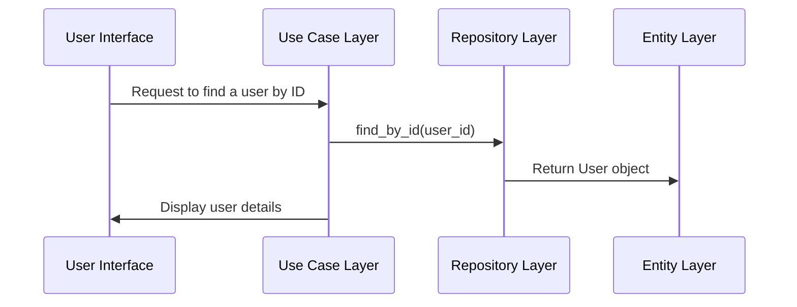

## System Architecture Overview

The system is designed following the Clean Architecture principles, ensuring separation of concerns and high modularity. The architecture consists of several layers including Entities, Use Cases, Interfaces, and Frameworks & Drivers.

## Module and Class Specifications

### Class Names, Methods, Signatures, Docstrings

#### User Entity
- `class User`
  - `__init__(self, user_id: int, username: str)`
    - Initializes a new user with an ID and username.
  - `get_user_id(self) -> int`
    - Returns the user's ID.
  - `set_username(self, username: str)`
    - Sets a new username for the user.

#### UserRepository Interface
- `interface UserRepository`
  - `find_by_id(self, user_id: int) -> User`
    - Finds and returns a user by their ID.
  - `save(self, user: User)`
    - Saves or updates a user in the repository.

## Structural & Sequence Flow

