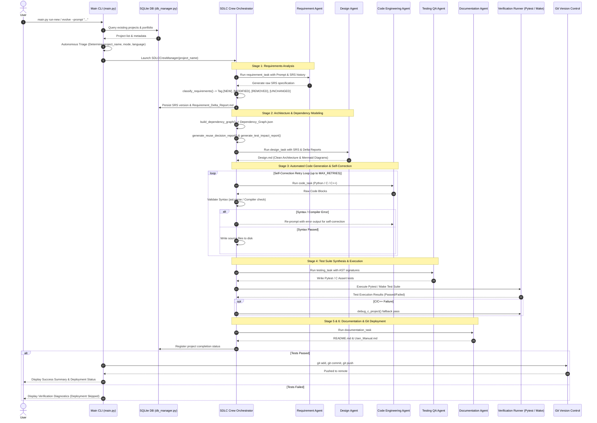

# ⚡ EvoForge SDLC Framework

> **Autonomous, Multi-Agent Software Development Lifecycle (SDLC) Engineering Engine**

EvoForge is an advanced autonomous multi-agent framework designed to execute complete, end-to-end Software Development Lifecycles. Given a natural language user prompt, EvoForge autonomously triages project requirements, synthesizes ISO/IEC/IEEE 29148 compliant Software Requirements Specifications (SRS), generates Clean Architecture software designs, engineers production-ready code in multiple programming languages (Python, C, C++), creates automated test suites, validates syntax and runtime semantics via self-correction loops, persists versioned state to an SQLite database, and executes automated Git deployment.

---

## 🗺️ Detailed Workflow Architecture

The EvoForge pipeline operates across **6 distinct autonomous stages**, combining LLM-powered specialized agents, static code analysis tools, deterministic fallback generators, runtime compilation/test runners, and version control integrations.

### 🔄 End-to-End Pipeline Flowchart

```mermaid
graph TD
    A["User Input / Requirement Prompt"] --> B["CLI Triage & Language Detection<br/>(main.py & autonomous_triage)"]
    
    subgraph STAGE_0 ["Stage 0: Project Scope & Triage"]
        B --> B1{"Project Exists in DB?"}
        B1 -- Yes --> B2["Mode: EVOLVE<br/>(Load Existing SRS & Codebase)"]
        B1 -- No --> B3["Mode: NEW<br/>(Greenfield Initialization)"]
        B --> B4["Detect Target Language<br/>(Python / C / C++)"]
    end

    B2 --> C["Stage 1: Requirements Analysis<br/>(requirement_agent & classify_requirements)"]
    B3 --> C
    B4 --> C

    subgraph STAGE_1 ["Stage 1: Requirements Analysis & SRS Synthesis"]
        C --> C1["Synthesize ISO/IEC/IEEE 29148 SRS.md"]
        C1 --> C2["Classify Requirements Delta:<br/>[NEW], [MODIFIED], [REMOVED], [UNCHANGED]"]
        C2 --> C3["Persist SRS.md & Requirement_Delta_Report.md"]
        C3 --> C4["Store SRS Version in SQLite DB"]
    end

    C4 --> D["Stage 2: Architecture & Impact Modeling<br/>(design_agent & static_analysis)"]

    subgraph STAGE_2 ["Stage 2: Architecture & Dependency Modeling"]
        D --> D1["Static Dependency Graph Analysis<br/>(build_dependency_graph -> Dependency_Graph.json)"]
        D1 --> D2["Asset Reuse & Impact Analysis<br/>(Reuse_Decision_Report.md & Test_Impact_Report.md)"]
        D2 --> D3["Synthesize Clean Architecture Design<br/>(Design.md with Mermaid Diagrams)"]
    end

    D3 --> E["Stage 3: Automated Code Engineering<br/>(code_agent / c_code_agent)"]

    subgraph STAGE_3 ["Stage 3: Code Generation & Self-Correction Loop"]
        E --> E1["Generate Source & Header Files<br/>(Python / C / C++)"]
        E1 --> E2{"Syntax & Compiler Check<br/>(ast.parse / gcc / g++)"}
        E2 -- "Failed (Syntax / Compiler Error)" --> E3{"Retries < MAX_RETRIES?"}
        E3 -- Yes --> E4["Feedback Error Traceback to LLM<br/>(Self-Correction Prompt)"]
        E4 --> E1
        E3 -- No --> E5["Deterministic Fallback Scaffold Generator"]
        E2 -- "Passed" --> E6["Write Source Code to disk (projects/project_name/)"]
        E5 --> E6
    end

    E6 --> F["Stage 4: Automated Testing & Verification<br/>(testing_agent / c_testing_agent)"]

    subgraph STAGE_4 ["Stage 4: Test Suite & Impact Mapping"]
        F --> F1["Generate Assertion-Backed Test Suite<br/>(pytest for Python / assert.h runner for C/C++)"]
        F1 --> F2{"Test Execution Verification<br/>(pytest / make test)"}
        F2 -- "Failed (C/C++)" --> F3["Automated C/C++ Debugging Pass<br/>(debug_c_project)"]
        F3 --> F4{"Debug Pass Succeeded?"}
        F4 -- Yes --> F5["Test Verification Passed"]
        F4 -- No --> F6["Test Verification Failed"]
        F2 -- "Failed (Python)" --> F6
        F2 -- "Passed" --> F5
    end

    F5 --> G["Stage 5: Documentation & Spec Persistence<br/>(documentation_agent)"]
    F6 --> G

    subgraph STAGE_5 ["Stage 5: Documentation & Database Update"]
        G --> G1["Synthesize Project README.md & User_Manual.md"]
        G1 --> G2["Update SQLite Portfolio Database (db_manager.py)"]
    end

    G2 --> H["Stage 6: Verification Summary & Automated Git Deployment"]

    subgraph STAGE_6 ["Stage 6: Automated Deployment"]
        H --> H1{"All Tests Passed?"}
        H1 -- Yes --> H2["Stage Files: git add projects/ & reports/"]
        H2 --> H3["Commit: git commit -m 'auto(sdlc): update...'"]
        H3 --> H4["Push: git push to Remote Repository"]
        H4 --> H5["Deployment Success Output Summary"]
        H1 -- No --> H6["Skip Git Deployment & Display Diagnostics Warning"]
    end
```



---

### ⏱️ Agent Interaction & Execution Sequence Diagram



---

## 📌 Detailed Breakdown of Pipeline Stages

| Stage | Name | Key Components & Tools | Artifacts Produced | Description |
| :--- | :--- | :--- | :--- | :--- |
| **0** | **Autonomous Triage & Scope** | `autonomous_triage()`, `detect_language()`, SQLite DB | Triage Metadata | Classifies user prompt into `project_name`, determines execution mode (`new` vs `evolve`), and auto-detects programming language (`python`, `c`, `cpp`). |
| **1** | **Requirements Engineering** | `requirement_agent`, `classify_requirements()`, DB Manager | `SRS.md`, `Requirement_Delta_Report.md` | Synthesizes ISO/IEEE 29148 compliant software specs. Classifies every requirement line with explicit status tags: `[NEW]`, `[MODIFIED]`, `[REMOVED]`, `[UNCHANGED]`. |
| **2** | **Architecture & Dependency Modeling** | `design_agent`, `build_dependency_graph()`, `generate_reuse_decision_report()` | `Design.md`, `Dependency_Graph.json`, `Reuse_Decision_Report.md`, `Test_Impact_Report.md` | Maps static dependencies, evaluates existing codebase components for reuse, and generates Clean Architecture software specifications with visual Mermaid diagrams. |
| **3** | **Automated Code Engineering** | `code_agent`, `c_code_agent`, `ast.parse`, GCC/G++ Compiler | Source (`.py`, `.c`, `.cpp`), Headers (`.h`, `.hpp`), `Makefile` | Generates modular source code. Runs an automated syntax/compiler validation loop (`_validate_syntax`) with pre-compilation static auto-repair (`debug_c_project`), language-specific header isolation, and C module function prefixing. Falls back to domain-matched templates if retries expire. |
| **4** | **Testing & Impact Mapping** | `testing_agent`, `c_testing_agent`, Pytest / Make Runner | `tests/test_*.py` or `tests/test_runner.c` | Synthesizes assertion-backed automated test suites covering positive, boundary, and negative vectors. Makefile dynamically filters out `main()` entry files to prevent linker collisions. Executes test suites automatically and triggers automated C/C++ debugging if compilation fails. |
| **5** | **Documentation & Persistence** | `documentation_agent`, `DBManager` | Project `README.md`, `User_Manual.md`, SQLite State | Updates project-level documentation, user interaction manuals, and commits full execution history to `database/project_state.db`. |
| **6** | **Verification & Git Deployment** | `compile_project()`, `run_c_tests()`, Pytest, Git Subprocess | Git Commit & Push Logs | Verifies final test pass state. If 100% clean, automatically stages modified directories (`projects/`, `reports/`), commits changes, and pushes to remote Git repository. |

---

## 🛠️ Features & Capabilities

- 🤖 **Autonomous Multi-Agent Crew Orchestration**: CrewAI-backed specialized role-playing agents (Requirements Engineer, Software Architect, Code Engineer, QA Engineer, Technical Writer).
- 🏷️ **Requirement Delta Classification**: Precise line-item tracking using `[NEW]`, `[MODIFIED]`, `[REMOVED]`, and `[UNCHANGED]` tags across project iterations.
- 🔁 **Self-Correction & Static Guardrails**: Pre-compilation static bug repair pass (`debug_c_project`), automated standard header injection (`<limits.h>`, `<stdbool.h>`, `<iostream>`), and multi-pass error feedback loops for Python and C/C++.
- 🛡️ **C/C++ Symbol Collision Guard**: Enforces module function prefixing (e.g. `avl_remove`, `queue_push`) to prevent global namespace collisions with standard C library functions (`remove`, `rename`, `read`, `write`, `log`).
- ⚙️ **Dynamic Build Isolation**: Auto-detects non-test `main()` entry points and dynamically excludes their object files from test runner linking.
- 🌐 **Multi-Language Support**: Native generation and verification for Python 3 (Pytest), C11 (GCC/Make), and C++17 (G++/Make).
- 💾 **SQLite Portfolio & State Tracking**: Persistent schema tracking projects, SRS versions, dependency graphs, and build outcomes.
- 🔌 **LLM Provider Support**:
  - **Offline / Local**: Ollama (`qwen2.5-coder`, `llama3`).
- 🚀 **Automated Git Deployment**: Intelligent git staging, commit messaging, and remote repository push upon successful verification.

---

## 📁 Project Directory Structure

```
EvoForge/
├── agents/                      # Multi-agent definitions & crew orchestrator
│   ├── base_agent.py            # Base LLM provider initialization (Ollama)
│   └── sdlc_crew.py             # 5-stage SDLC crew pipeline & self-correction loops
├── config/                      # Agent roles, goals, and task prompt templates
│   ├── agents.yaml
│   └── tasks.yaml
├── database/                    # SQLite version control & state storage
│   ├── db_manager.py
│   └── project_state.db
├── projects/                    # Generated project codebases (Python / C / C++)
├── reports/                     # SDLC specs (SRS.md, Design.md, Delta Reports)
├── tools/                       # Core analysis, build, and static analysis utilities
│   ├── build_tools.py           # Makefile generation & C/C++ build/debug runner
│   ├── cli_ui.py                # Rich terminal UI rendering
│   ├── impact_tools.py          # Impact analysis reporting
│   ├── language_tools.py        # Language auto-detection
│   ├── requirement_tools.py     # Requirement delta classifier
│   ├── reuse_tools.py           # Asset reuse analysis
│   ├── semantic_evaluation.py   # Semantic coverage scorer
│   └── static_analysis.py       # AST & static dependency graph generator
├── .env.example                 # Environment configuration template
├── main.py                      # CLI entry point & autonomous project triage
├── README.md                    # System documentation & detailed workflow chart
└── README_offline.md            # Offline execution guide for Ollama
```

---

## 🚀 Quick Start Guide

### 1. Prerequisites
- **Python 3.8+** (Python 3.12 recommended)
- **Git** & **[Git LFS](https://git-lfs.github.com)** *(Required to download binary payload `evoforge_env.tar.gz`)*
- **GCC / G++ & Make** *(Optional, required for building C/C++ projects)*
- **[Ollama](https://ollama.com)** *(Local LLM Provider running coding model e.g. `qwen2.5-coder:14b` or `llama3`)*

---

### 2. Download & Clone Repository
Clone the repository using Git and navigate into the project directory:

```bash
# Clone the repository (branch: new)
git clone -b new https://github.com/jahnaviyakkala/EvoForge.git
cd EvoForge

# Download Git LFS binary payload (fetches complete evoforge_env.tar.gz)
git lfs pull
```

> [!IMPORTANT]
> **Git LFS Note**: `evoforge_env.tar.gz` is stored using **Git LFS**. 
> - Always run `git lfs pull` after cloning so the full ~376MB environment archive is downloaded (otherwise only a 130-byte pointer file will exist).
> - **GitHub "Download ZIP" Caveat**: Downloading as a ZIP archive from the GitHub UI does **NOT** fetch Git LFS binaries automatically. Always use `git clone` and `git lfs pull`.

---

### 3. Environment & Model Setup

#### Step 3.1: Configure Environment Variables
Create your local `.env` configuration file from `.env.example`:

```bash
cp .env.example .env
```

Ensure `.env` is configured for your local Ollama setup:
```env
# LLM Provider Selection
LLM_PROVIDER=ollama
OLLAMA_MODEL=qwen2.5-coder:14b
OLLAMA_BASE_URL=http://localhost:11434

# Offline Telemetry Settings
CREWAI_DISABLE_TELEMETRY=true
OTEL_SDK_DISABLED=true
CREWAI_TRACING_ENABLED=false
```

#### Step 3.2: Start Ollama & Pull Model
Ensure the Ollama model server is active and has pulled the requested coding model:

```bash
# Start Ollama service (if not running in background)
ollama serve

# Pull target LLM model
ollama pull qwen2.5-coder:14b
```

#### Step 3.3: Activate Python Environment (Choose One Option)

##### 📦 Option A: Unpack Pre-packed Conda Archive (`evoforge_env.tar.gz`) *(Recommended for Linux / WSL)*
```bash
# 1. Create target directory
mkdir -p evoforge_env

# 2. Extract environment archive
tar -xzf evoforge_env.tar.gz -C evoforge_env

# 3. Activate the environment
source evoforge_env/bin/activate

# 4. Re-bind binary paths for the local system (run once upon unpacking)
conda-unpack
```

##### 🐍 Option B: Create Environment from `environment.yml` *(Conda / Mamba)*
```bash
conda env create -f environment.yml -n evoforge_env
conda activate evoforge_env
```

##### ⚡ Option C: Standard Virtual Environment (`pip`)
```bash
python -m venv .venv

# Activate environment:
# On Linux / macOS:
source .venv/bin/activate
# On Windows PowerShell:
# .venv\Scripts\Activate.ps1

pip install -r requirements.txt
```

---

### 4. Running EvoForge

#### 🔹 Run Greenfield Project (New)
Autonomously triages requirements and engineers a brand-new project:
```bash
python main.py run-new --prompt "Create a Python utility that parses CSV files and exports to JSON and XML."
```

#### 🔹 Evolve Existing Project
Increments requirements on an existing project registered in the portfolio database:
```bash
python main.py evolve --name "csv_parser" --prompt "Add support for YAML export format."
```

#### 🔹 Interactive Mode
Prompts interactively for natural language project requirements:
```bash
python main.py
```

#### 🔹 Portfolio Management & Diagnostics
```bash
# List all registered projects in SQLite database
python main.py list

# Inspect project artifacts, specs, and file registry
python main.py inspect --name "csv_parser"

# Display system configuration and LLM status
python main.py config
```

---

## 🧪 Testing & Verification

Run the full EvoForge unit test suite:
```bash
pytest
```

---

## 📄 License

This project is licensed under the MIT License.
