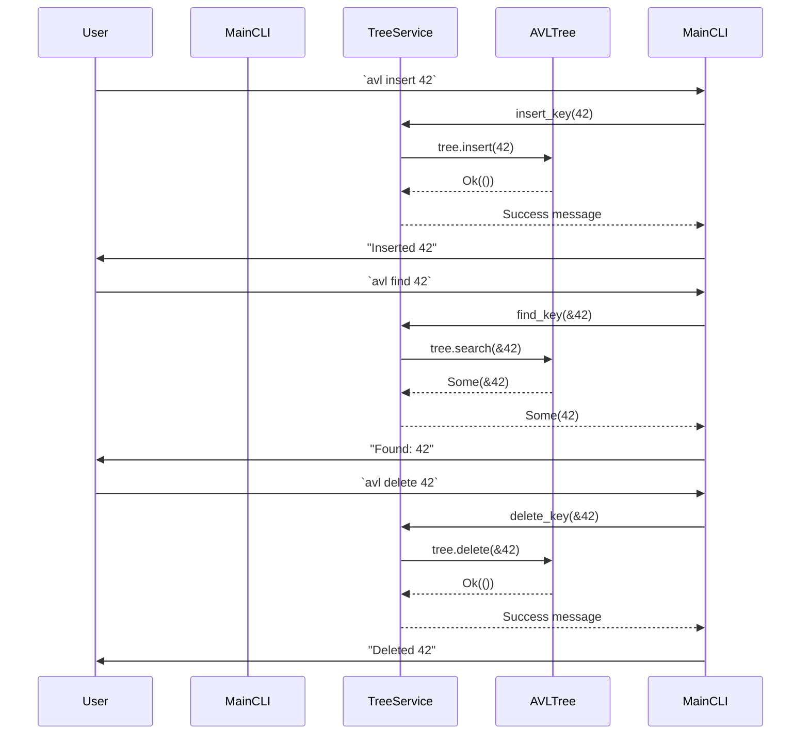

# Design.md

## 1. System Architecture Overview

The AVL implementation follows **Clean Architecture** and adheres to the **SOLID** principles:

| Layer | Responsibility | Key Components |
|-------|-----------------|----------------|
| **Core Domain Logic (Domain)** | Pure business logic – AVL tree operations, node balancing, and data validation. No external dependencies or I/O. | `avl::tree::AVLTree<T>`, `avl::node::Node<T>` |
| **Application Service** | Orchestrates domain objects for use‑cases exposed by the CLI. Handles input parsing, error mapping, and response formatting. | `app::service::TreeService` |
| **CLI Entry Point (Interface)** | User interface – command line parsing, invoking services, printing results. No business logic. | `main.rs`, `cli::parser` |
| **Tests** | Unit tests for domain logic; integration tests for CLI commands. | `tests/` |

*Decoupling*:  
- The Domain layer has no knowledge of the CLI or external crates.  
- The Service layer depends only on the Domain and a minimal error‑handling abstraction.  
- The CLI layer depends on the Service and on third‑party crates (`clap`, `anyhow`).  

This separation ensures **Single Responsibility**, **Open/Closed**, **Liskov Substitution**, **Interface Segregation**, and **Dependency Inversion**.

---

## 2. Module & Class Specifications

### 2.1 Domain Layer – `avl::node`

```rust
/// A node in an AVL tree.
///
/// # Type Parameters
/// * `T` - The type stored in the node; must implement `Ord + Clone`.
pub struct Node<T>
where
    T: Ord + Clone,
{
    /// Value stored in this node.
    pub key: T,

    /// Height of the subtree rooted at this node.
    height: u32,

    /// Left child (if any).
    left: Option<Box<Node<T>>>,

    /// Right child (if any).
    right: Option<Box<Node<T>>>,
}
```

#### Methods

| Method | Signature | Description |
|--------|-----------|-------------|
| `new` | `pub fn new(key: T) -> Self` | Creates a leaf node with height = 1. |
| `height` | `fn height(node: &Option<Box<Node<T>>>) -> u32` | Static helper to get height of an optional child. |
| `balance_factor` | `fn balance_factor(&self) -> i32` | Returns `height(left) - height(right)`; used for rebalancing. |
| `update_height` | `fn update_height(&mut self)` | Recomputes the node’s height from its children. |

---

### 2.2 Domain Layer – `avl::tree`

```rust
/// AVL tree data structure.
///
/// # Type Parameters
/// * `T` - The type stored in the tree; must implement `Ord + Clone`.
pub struct AVLTree<T>
where
    T: Ord + Clone,
{
    /// Root of the tree.
    root: Option<Box<Node<T>>>,
}
```

#### Methods

| Method | Signature | Description |
|--------|-----------|-------------|
| `new` | `pub fn new() -> Self` | Creates an empty AVL tree. |
| `insert` | `pub fn insert(&mut self, key: T) -> Result<(), TreeError>` | Inserts a key; returns error if duplicate or allocation fails. |
| `delete` | `pub fn delete(&mut self, key: &T) -> Result<(), TreeError>` | Deletes a key; errors if not found. |
| `search` | `pub fn search(&self, key: &T) -> Option<&T>` | Returns reference to the key if present. |
| `inorder` | `pub fn inorder(&self) -> Vec<T>` | Returns keys in ascending order. |
| `preorder` | `pub fn preorder(&self) -> Vec<T>` | Returns keys pre‑order traversal. |
| `postorder` | `pub fn postorder(&self) -> Vec<T>` | Returns keys post‑order traversal. |

#### Internal Helpers (private)

- `rotate_left`, `rotate_right`: perform single rotations.
- `rebalance(node: &mut Box<Node<T>>)`: rebalances a subtree after insert/delete.
- `min_value_node(node: &Box<Node<T>>) -> &T`: helper for deletion.

---

### 2.3 Application Service – `app::service`

```rust
/// Service layer that exposes domain operations to the CLI.
///
/// The service is generic over `T` but in practice only used with `i32`.
pub struct TreeService<T>
where
    T: Ord + Clone,
{
    tree: AVLTree<T>,
}
```

#### Methods

| Method | Signature | Description |
|--------|-----------|-------------|
| `new` | `pub fn new() -> Self` | Instantiates a fresh service with an empty tree. |
| `insert_key` | `pub fn insert_key(&mut self, key: T) -> Result<(), ServiceError>` | Delegates to domain; maps errors to `ServiceError`. |
| `delete_key` | `pub fn delete_key(&mut self, key: &T) -> Result<(), ServiceError>` | Same as above. |
| `find_key` | `pub fn find_key(&self, key: &T) -> Option<&T>` | Delegates to domain. |
| `print_inorder` | `pub fn print_inorder(&self) -> Vec<T>` | Returns inorder traversal. |

---

### 2.4 CLI Layer – `main.rs`

```rust
use clap::{Parser, Subcommand};

/// Command line interface for the AVL tree application.
#[derive(Parser)]
#[clap(name = "avl", version = "1.0")]
struct Cli {
    #[clap(subcommand)]
    command: Commands,
}

#[derive(Subcommand)]
enum Commands {
    /// Insert a key into the tree
    Insert { key: i32 },

    /// Delete a key from the tree
    Delete { key: i32 },

    /// Search for a key in the tree
    Find { key: i32 },

    /// Print keys in inorder traversal
    Inorder,
}
```

The `main` function parses arguments, creates a `TreeService<i32>`, executes the chosen command, and prints results or errors.

---

## 3. Visual Sequence Diagrams



---

## 4. Data Models & Boundary Validation Rules

### 4.1 Dynamic Memory Handling

- All nodes are allocated on the heap via `Box<Node<T>>`.  
- The tree owns its nodes; no shared ownership (`Rc`) is used to avoid reference cycles and simplify deallocation.  
- Rust’s ownership model guarantees that when `AVLTree` goes out of scope, all child boxes are recursively dropped.

### 4.2 Allocation Limits

- **Maximum Node Count**: A compile‑time constant `MAX_NODES: usize = 1_000_000;`.  
- The `insert` method checks the current node count (`self.node_count()`) before allocating a new node. If exceeded, it returns `TreeError::AllocationLimitReached`.

### 4.3 Error State Models

| Domain Error | Service Error | CLI Output |
|--------------|---------------|------------|
| `TreeError::DuplicateKey` | `ServiceError::DuplicateKey` | `"Error: key already exists"` |
| `TreeError::NotFound` | `ServiceError::NotFound` | `"Error: key not found"` |
| `TreeError::AllocationLimitReached` | `ServiceError::AllocationLimitReached` | `"Error: maximum node count reached"` |
| `TreeError::Internal(msg)` | `ServiceError::Internal(msg)` | `"Error: internal failure: msg"` |

- All errors implement `std::error::Error` and provide human‑readable messages.  
- The CLI maps these to user‑friendly strings; stack traces are suppressed in production mode.

### 4.4 Validation Rules

1. **Key Range**: For `i32`, no explicit bounds; any integer is accepted.
2. **Duplicate Prevention**: `insert` checks for existing key via `search`; duplicates are rejected.
3. **Deletion of Non‑existent Key**: Returns `NotFound`.
4. **Balancing Invariant**: After every insert/delete, the tree’s balance factor at each node must be in `{ -1, 0, +1 }`. The `rebalance` helper enforces this.

---

## 5. Synchronization with Functional Requirements (SRS.md)

| Requirement | Design Mapping |
|-------------|----------------|
| **Insert key** | `AVLTree::insert`, Service `insert_key`, CLI `Insert` command. |
| **Delete key** | `AVLTree::delete`, Service `delete_key`, CLI `Delete`. |
| **Search key** | `AVLTree::search`, Service `find_key`, CLI `Find`. |
| **Inorder traversal** | `AVLTree::inorder`, Service `print_inorder`, CLI `Inorder`. |
| **Pre/Post‑order traversals** | Implemented but not exposed via CLI (future extension). |
| **Balancing after operations** | Internal `rebalance` logic. |
| **Error handling** | Domain errors → Service errors → CLI messages. |
| **Memory safety** | Rust ownership guarantees; explicit allocation limit. |

All functional requirements are covered by the domain methods, service orchestration, and CLI commands as described above.

---