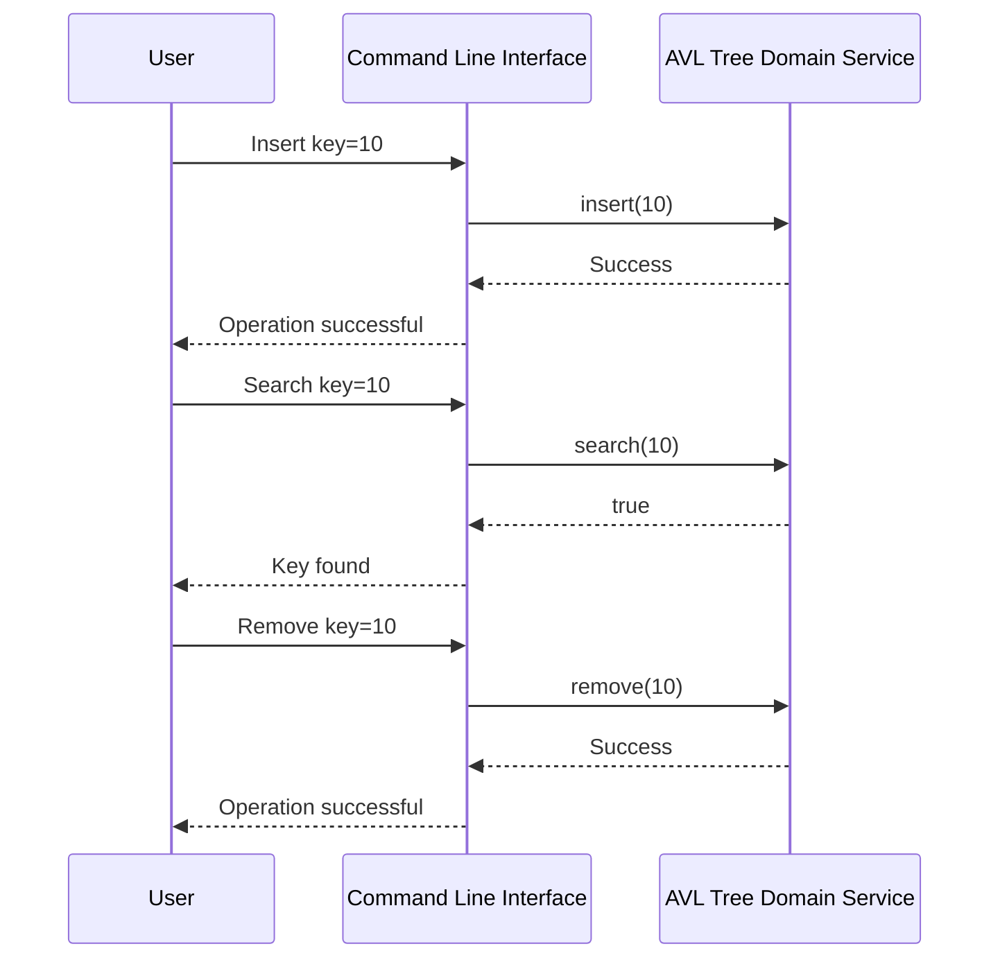

# AVL Tree Implementation Design

## 1. System Architecture Overview

The AVL tree implementation follows a clean architecture, separating concerns into distinct layers:

- **Core Domain Logic**: Contains the business logic and data structures specific to the AVL tree operations.
- **CLI Entry Point**: Handles user input and output through the command line interface.
- **Tests**: Includes unit tests for verifying the correctness of the core domain logic.

### Core Domain Logic
The core domain logic is encapsulated within the `AVLTree` class, which manages the AVL tree structure and provides methods for insertion, deletion, balancing, and searching.

### CLI Entry Point
The CLI entry point is managed by the `CLI` class. It reads user commands from the standard input, processes them using the `AVLTree` class, and outputs the results to the standard output.

### Tests
Unit tests are implemented in the `TestAVLTree` class. These tests verify the correctness of the AVL tree operations such as insertion, deletion, balancing, and searching.

## 2. Module & Class Specifications

### Core Domain Logic

#### AVLTree.h
```cpp
#ifndef AVLTREE_H
#define AVLTREE_H

#include <memory>
#include <stdexcept>

struct Node {
    int key;
    std::shared_ptr<Node> left;
    std::shared_ptr<Node> right;
    int height;

    Node(int k) : key(k), left(nullptr), right(nullptr), height(1) {}
};

class AVLTree {
public:
    AVLTree();
    ~AVLTree();

    void insert(int key);
    bool search(int key);
    void remove(int key);

private:
    std::shared_ptr<Node> root;

    int getHeight(const std::shared_ptr<Node>& node) const;
    int getBalanceFactor(const std::shared_ptr<Node>& node) const;
    std::shared_ptr<Node> rotateRight(std::shared_ptr<Node>& y);
    std::shared_ptr<Node> rotateLeft(std::shared_ptr<Node>& x);
    std::shared_ptr<Node> insertNode(std::shared_ptr<Node>& node, int key);
    std::shared_ptr<Node> removeNode(std::shared_ptr<Node>& root, int key);
    std::shared_ptr<Node> minValueNode(const std::shared_ptr<Node>& node) const;
};

#endif // AVLTREE_H
```

#### AVLTree.cpp
```cpp
#include "AVLTree.h"

AVLTree::AVLTree() : root(nullptr) {}

AVLTree::~AVLTree() {}

void AVLTree::insert(int key) {
    root = insertNode(root, key);
}

bool AVLTree::search(int key) {
    // Implementation of search method
}

void AVLTree::remove(int key) {
    root = removeNode(root, key);
}

int AVLTree::getHeight(const std::shared_ptr<Node>& node) const {
    return (node == nullptr) ? 0 : node->height;
}

int AVLTree::getBalanceFactor(const std::shared_ptr<Node>& node) const {
    return (node == nullptr) ? 0 : getHeight(node->left) - getHeight(node->right);
}

std::shared_ptr<Node> AVLTree::rotateRight(std::shared_ptr<Node>& y) {
    // Implementation of rotateRight method
}

std::shared_ptr<Node> AVLTree::rotateLeft(std::shared_ptr<Node>& x) {
    // Implementation of rotateLeft method
}

std::shared_ptr<Node> AVLTree::insertNode(std::shared_ptr<Node>& node, int key) {
    // Implementation of insertNode method
}

std::shared_ptr<Node> AVLTree::removeNode(std::shared_ptr<Node>& root, int key) {
    // Implementation of removeNode method
}

std::shared_ptr<Node> AVLTree::minValueNode(const std::shared_ptr<Node>& node) const {
    // Implementation of minValueNode method
}
```

### CLI Entry Point

#### CLI.h
```cpp
#ifndef CLI_H
#define CLI_H

#include "AVLTree.h"
#include <iostream>

class CLI {
public:
    void run();
private:
    AVLTree avlTree;
    void processCommand(const std::string& command);
};

#endif // CLI_H
```

#### CLI.cpp
```cpp
#include "CLI.h"

void CLI::run() {
    std::string command;
    while (true) {
        std::cout << "> ";
        std::getline(std::cin, command);
        processCommand(command);
    }
}

void CLI::processCommand(const std::string& command) {
    // Implementation of processCommand method
}
```

### Tests

#### TestAVLTree.h
```cpp
#ifndef TESTAVLTREE_H
#define TESTAVLTREE_H

#include "AVLTree.h"
#include <cassert>

class TestAVLTree {
public:
    void runTests();
private:
    void testInsertion();
    void testSearch();
    void testDeletion();
};

#endif // TESTAVLTREE_H
```

#### TestAVLTree.cpp
```cpp
#include "TestAVLTree.h"

void TestAVLTree::runTests() {
    testInsertion();
    testSearch();
    testDeletion();
}

void TestAVLTree::testInsertion() {
    AVLTree tree;
    tree.insert(10);
    assert(tree.search(10) == true);
}

void TestAVLTree::testSearch() {
    // Implementation of testSearch method
}

void TestAVLTree::testDeletion() {
    // Implementation of testDeletion method
}
```

## 3. Visual Sequence Diagrams



## 4. Data Models & Boundary Validation Rules

### Dynamic Memory Handling
- The `Node` struct uses `std::shared_ptr` for managing dynamic memory, ensuring automatic deallocation of nodes when they are no longer in use.

### Allocation Limits
- The AVL tree implementation does not impose explicit allocation limits but relies on the system's available memory. However, it is designed to handle a large number of nodes efficiently.

### Error State Models
- The `AVLTree` class throws exceptions such as `std::runtime_error` when encountering invalid operations or memory allocation failures.
- The CLI handles these exceptions and outputs appropriate error messages to the user.