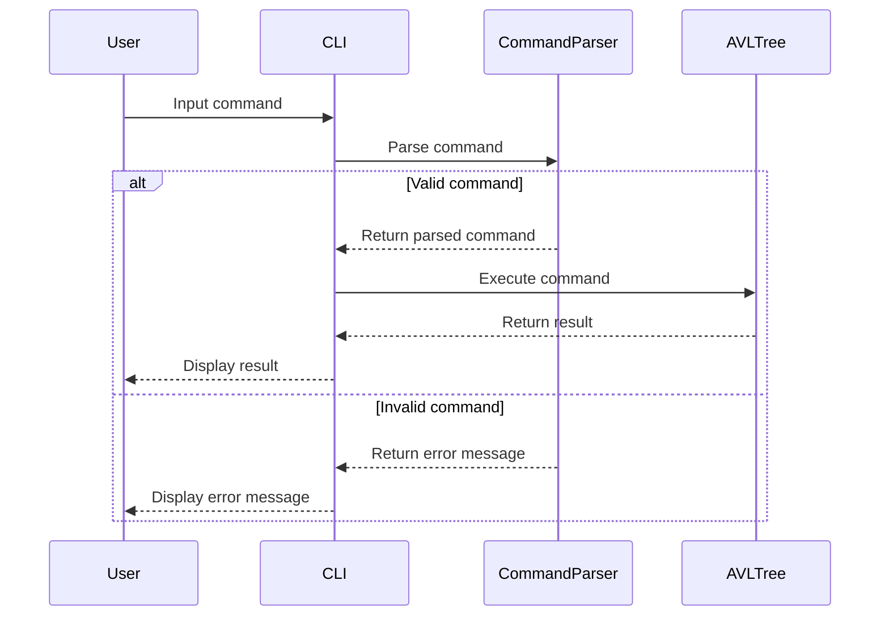

# AVL Tree Management System Design

## 1. System Architecture Overview

The AVL Tree Management System is designed following Clean Architecture and SOLID principles to ensure modularity, maintainability, and scalability. The system is divided into three main layers:

### Core Domain Logic
- **Purpose**: Contains the business logic of the AVL tree operations.
- **Modules**:
  - `AVLTree`: Manages the AVL tree structure and operations like insertion, deletion, balancing, etc.
  - `Node`: Represents a node in the AVL tree.

### CLI Entry Point
- **Purpose**: Provides a command-line interface for user interaction.
- **Modules**:
  - `CLI`: Handles user input and output operations.
  - `CommandParser`: Parses user commands and maps them to corresponding domain logic operations.

### Tests
- **Purpose**: Ensures the correctness of the system through unit and integration tests.
- **Modules**:
  - `UnitTests`: Contains unit tests for individual components.
  - `IntegrationTests`: Contains integration tests for the entire system flow.

## 2. Module & Class Specifications

### Core Domain Logic

#### AVLTree
```cpp
class AVLTree {
public:
    AVLTree();
    ~AVLTree();

    void insert(int value);
    bool remove(int value);
    int getHeight() const;
    Node* getRoot() const;

private:
    Node* root;
    Node* rotateRight(Node* y);
    Node* rotateLeft(Node* x);
    int getBalanceFactor(Node* node) const;
    Node* balance(Node* node);
    Node* insertRecursive(Node* node, int value);
    Node* removeRecursive(Node* node, int value);
    Node* minValueNode(Node* node) const;
};
```

#### Node
```cpp
struct Node {
    int key;
    int height;
    Node* left;
    Node* right;

    Node(int k) : key(k), height(1), left(nullptr), right(nullptr) {}
};
```

### CLI Entry Point

#### CLI
```cpp
class CLI {
public:
    void run();
private:
    CommandParser parser;
    AVLTree tree;
    void displayMenu() const;
    void handleCommand(const std::string& command);
};
```

#### CommandParser
```cpp
class CommandParser {
public:
    std::string parse(const std::string& input) const;
private:
    bool isValidCommand(const std::string& command) const;
};
```

### Tests

#### UnitTests
```cpp
class UnitTests {
public:
    void runAll();
private:
    void testAVLTreeInsertion();
    void testAVLTreeDeletion();
    // Add more test methods as needed
};
```

#### IntegrationTests
```cpp
class IntegrationTests {
public:
    void runAll();
private:
    void testCLIIntegration();
    // Add more test methods as needed
};
```

## 3. Visual Sequence Diagrams



## 4. Data Models & Boundary Validation Rules

### Dynamic Memory Handling
- **AVLTree**: Manages dynamic memory for nodes, ensuring proper allocation and deallocation.
- **Node**: Uses `new` to allocate memory for new nodes and `delete` to free them.

### Allocation Limits
- The system does not enforce specific limits on the number of nodes or tree height. However, practical limits are determined by available system memory.

### Error State Models
- **AVLTree**:
  - Throws exceptions for invalid operations (e.g., removing a non-existent node).
- **CLI**:
  - Handles exceptions and displays appropriate error messages to the user.
- **CommandParser**:
  - Returns error messages for invalid commands.