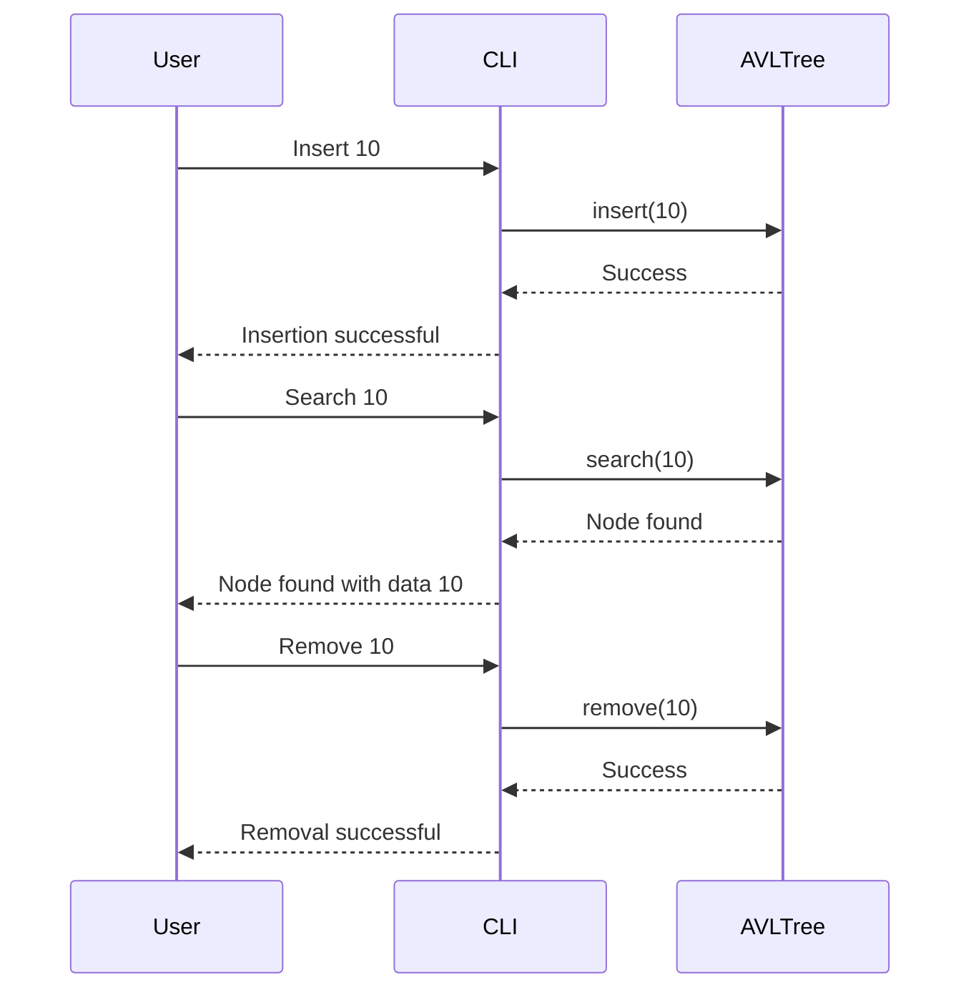

# AVL Tree Implementation Design

## 1. System Architecture Overview

The AVL tree implementation follows a clean architecture, ensuring separation of concerns and adherence to SOLID principles.

### Core Domain Logic
- **AVLTree**: Manages the AVL tree operations such as insertion, deletion, balancing, and searching.
- **Node**: Represents each node in the AVL tree with left and right children, height, and data.

### CLI Entry Point
- **CLI**: Handles user input and output. It translates user commands into requests for the domain logic and presents the results back to the user.

### Tests
- **UnitTests**: Contains unit tests for individual components (e.g., Node, AVLTree).
- **IntegrationTests**: Ensures that different modules work together as expected.

## 2. Module & Class Specifications

### Core Domain Logic

#### AVLTree
```cpp
class AVLTree {
public:
    AVLTree();
    ~AVLTree();

    void insert(int data);
    bool remove(int data);
    Node* search(int data) const;
    void inorderTraversal() const;

private:
    Node* root;
    Node* rotateRight(Node* y);
    Node* rotateLeft(Node* x);
    int getHeight(Node* N) const;
    int getBalanceFactor(Node* N) const;
    Node* insertRecursive(Node* node, int data);
    Node* removeRecursive(Node* root, int data);
    Node* minValueNode(Node* node) const;
};
```

#### Node
```cpp
struct Node {
    int data;
    Node* left;
    Node* right;
    int height;

    Node(int val) : data(val), left(nullptr), right(nullptr), height(1) {}
};
```

### CLI Entry Point

#### CLI
```cpp
class CLI {
public:
    void run();
private:
    AVLTree tree;
    void handleInsertCommand(const std::string& command);
    void handleRemoveCommand(const std::string& command);
    void handleSearchCommand(const std::string& command);
    void handleInorderTraversalCommand(const std::string& command);
};
```

### Tests

#### UnitTests
```cpp
class UnitTests {
public:
    void testNodeCreation();
    void testAVLTreeInsertion();
    void testAVLTreeRemoval();
    void testAVLTreeSearch();
};
```

#### IntegrationTests
```cpp
class IntegrationTests {
public:
    void testCLIInsertRemoveSearch();
    void testCLITraversal();
};
```

## 3. Visual Sequence Diagrams

### User Interaction with AVL Tree CLI


## 4. Data Models & Boundary Validation Rules

### Dynamic Memory Handling
- **Node Allocation**: Each node is dynamically allocated using `new` and deallocated using `delete`.
- **Memory Limits**: The system should handle memory allocation failures gracefully by checking if `new` returns `nullptr`.

### Error State Models
- **Insertion Errors**: If a duplicate key is inserted, the system should return an error indicating that the key already exists.
- **Removal Errors**: If a key to be removed does not exist in the tree, the system should return an error indicating that the key was not found.

This design ensures that the AVL tree implementation adheres to clean architecture principles and SOLID guidelines, providing a robust and maintainable codebase.