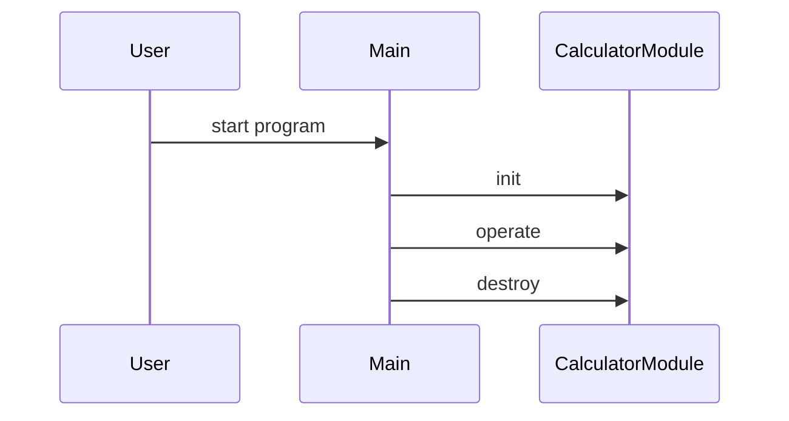

# Design Document

## Architecture Overview
The project is a C library providing a Calculator module.

## Module Specifications
- `calculator.h`: Public API declarations for the calculator component.
- `calculator.c`: Core implementation of calculator operations.
- `main.c`: Example usage and demonstration program.
- `tests/test_runner.c`: Automated test harness validating calculator functionality.

## Data Model
- `Calculator` struct storing module state and resources.

## Sequence Flow

