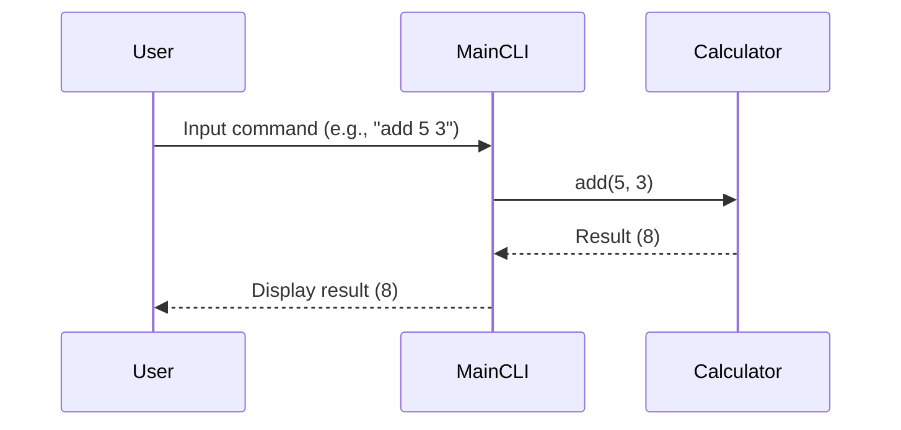

# Design Document

## System Architecture Overview

The system is designed following Clean Architecture and SOLID principles, ensuring a decoupled modular architecture with clear separation between layers.

### Core Domain Logic
- **Domain Entities**: Encapsulate business rules and logic.
- **Domain Services**: Provide operations that use domain entities to perform complex tasks.

### CLI Entry Point
- **Main CLI Class**: Acts as the entry point for user interaction, parsing commands and delegating tasks to domain services.

### Tests
- **Unit Tests**: Test individual components in isolation.
- **Integration Tests**: Test interactions between different modules.

## Module & Class Specifications

### Core Domain Logic

#### Classes
- **Calculator**
  - `add(a: int, b: int) -> int`
    - Adds two integers and returns the result.
  - `subtract(a: int, b: int) -> int`
    - Subtracts the second integer from the first and returns the result.

### CLI Entry Point

#### Classes
- **MainCLI**
  - `run() -> None`
    - Parses user input and delegates to appropriate domain service methods.
  - `_parse_input(input_str: str) -> tuple`
    - Parses the input string into operation type and operands.

### Tests

#### Classes
- **TestCalculator**
  - `test_addition() -> None`
    - Tests the addition method of Calculator.
  - `test_subtraction() -> None`
    - Tests the subtraction method of Calculator.

## Visual Sequence Diagrams

## Data Models & Boundary Validation Rules

### Dynamic Memory Handling
- **Memory Allocation**: Use smart pointers or RAII principles to manage memory allocation and deallocation.
- **Allocation Limits**: Ensure that the system does not allocate more than a predefined limit of memory.

### Error State Models
- **Error Handling**: Implement error handling mechanisms to manage invalid inputs and operations gracefully.
  - Return specific error codes or messages for different types of errors (e.g., division by zero, invalid input format).

This design ensures that the system is modular, maintainable, and adheres to SOLID principles.