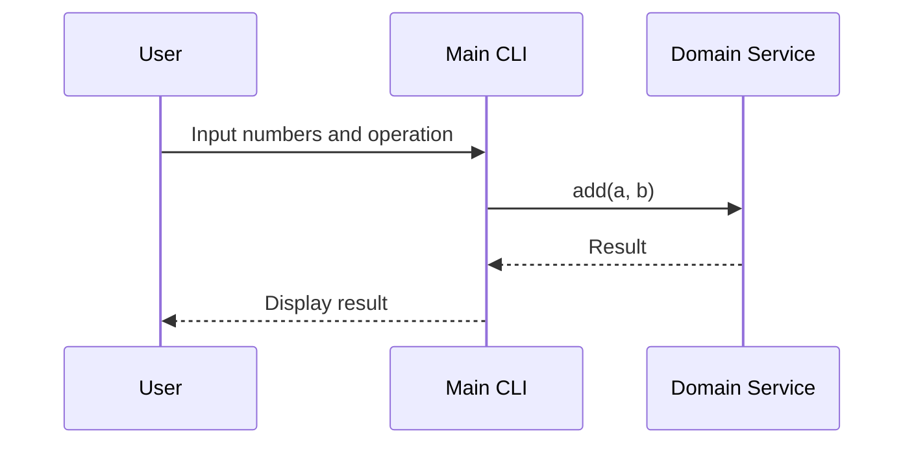

# Design Document

## 1. System Architecture Overview

The system follows a Clean Architecture, which is structured into decoupled modular layers:

- **Core Domain Logic**: Contains the business logic and rules that are independent of external interfaces.
- **CLI Entry Point**: Acts as the interface for user interaction via command line.
- **Tests**: Includes unit tests to validate the functionality of each module.

## 2. Module & Class Specifications

### Core Domain Logic
```cpp
// CalculationService.h
class CalculationService {
public:
    /**
     * @brief Performs addition of two numbers.
     * @param a First number.
     * @param b Second number.
     * @return Sum of the two numbers.
     */
    double add(double a, double b);

    /**
     * @brief Performs subtraction of two numbers.
     * @param a First number.
     * @param b Second number.
     * @return Difference between the two numbers.
     */
    double subtract(double a, double b);
};

// CalculationService.cpp
double CalculationService::add(double a, double b) {
    return a + b;
}

double CalculationService::subtract(double a, double b) {
    return a - b;
}
```

### CLI Entry Point
```cpp
// CalculatorCLI.h
class CalculatorCLI {
public:
    /**
     * @brief Runs the calculator application.
     */
    void run();
};

// CalculatorCLI.cpp
#include "CalculationService.h"

void CalculatorCLI::run() {
    CalculationService service;
    double a, b;
    std::cout << "Enter first number: ";
    std::cin >> a;
    std::cout << "Enter second number: ";
    std::cin >> b;

    double result = service.add(a, b);
    std::cout << "Result of addition: " << result << std::endl;
}
```

### Tests
```cpp
// CalculationServiceTest.h
#include <gtest/gtest.h>
#include "CalculationService.h"

class CalculationServiceTest : public ::testing::Test {
protected:
    CalculationService service;
};

TEST_F(CalculationServiceTest, TestAddition) {
    EXPECT_EQ(service.add(2.0, 3.0), 5.0);
}

TEST_F(CalculationServiceTest, TestSubtraction) {
    EXPECT_EQ(service.subtract(5.0, 3.0), 2.0);
}
```

## 3. Visual Sequence Diagrams



## 4. Data Models & Boundary Validation Rules

### Dynamic Memory Handling
- No dynamic memory allocation is required for this simple calculator application.

### Allocation Limits
- The application assumes that input numbers will fit within the range of `double` data type.

### Error State Models
- Basic error handling can be added in future versions to manage invalid inputs or operations.