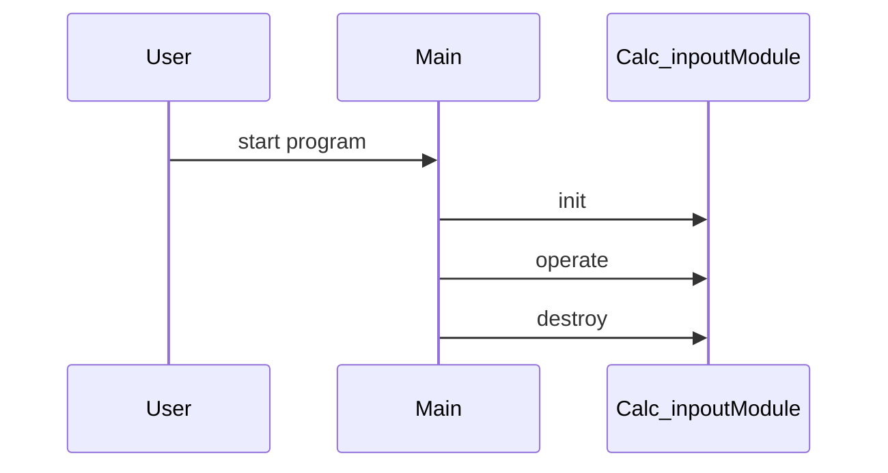

# Design Document

## Architecture Overview
The project is a C++ library providing a Calc_inpout module.

## Module Specifications
- `calc_inpout.hpp`: Public API declarations for the calc_inpout component.
- `calc_inpout.cpp`: Core implementation of calc_inpout operations.
- `main.cpp`: Example usage and demonstration program.
- `tests/test_runner.cpp`: Automated test harness validating calc_inpout functionality.

## Data Model
- `Calc_inpout` struct storing module state and resources.

## Sequence Flow

