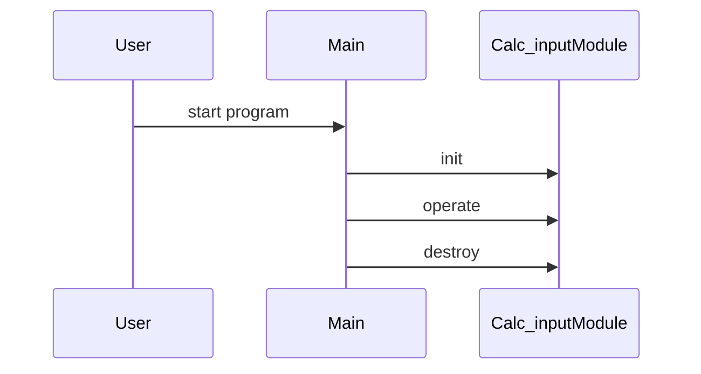

# Design Document

## Architecture Overview
The project is a C++ library providing a Calc_input module.

## Module Specifications
- `calc_input.hpp`: Public API declarations for the calc_input component.
- `calc_input.cpp`: Core implementation of calc_input operations.
- `main.cpp`: Example usage and demonstration program.
- `tests/test_runner.cpp`: Automated test harness validating calc_input functionality.

## Data Model
- `Calc_input` struct storing module state and resources.

## Sequence Flow

