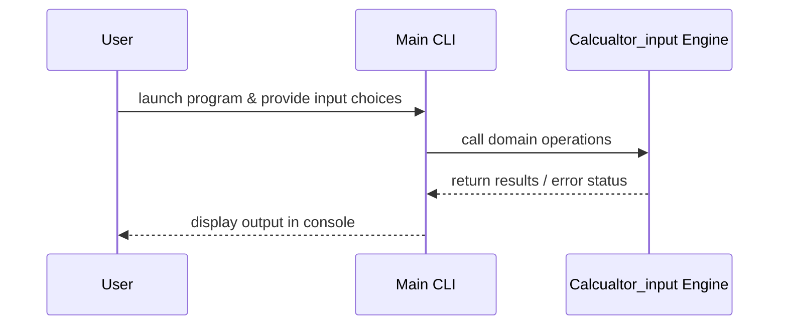

# Design Document

## Architecture Overview
The project is a C++ application providing the `calcualtor_input` module.

## Module Specifications
- `calcualtor_input.hpp`: Public API declarations for the Calcualtor Input component.
- `calcualtor_input.cpp`: Implementation of Calcualtor Input core logic.
- `main.cpp`: Interactive command-line interface accepting dynamic user inputs.
- `tests/test_runner.cpp`: Automated assertion test suite.

## Data Model
- Data structures and function signatures declared in `calcualtor_input.hpp`.

## Sequence Flow

