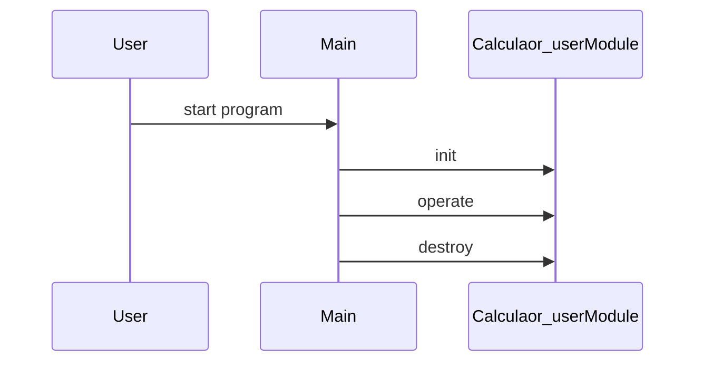

# Design Document

## Architecture Overview
The project is a C++ library providing a Calculaor_user module.

## Module Specifications
- `calculaor_user.hpp`: Public API declarations for the calculaor_user component.
- `calculaor_user.cpp`: Core implementation of calculaor_user operations.
- `main.cpp`: Example usage and demonstration program.
- `tests/test_runner.cpp`: Automated test harness validating calculaor_user functionality.

## Data Model
- `Calculaor_user` struct storing module state and resources.

## Sequence Flow

