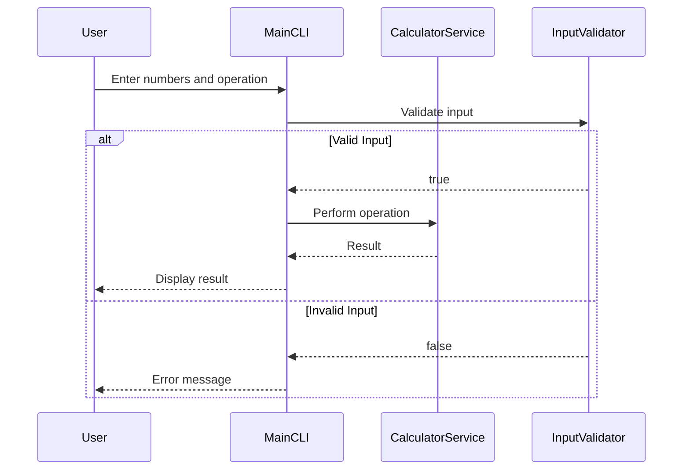

# Design Document for Calculator Input

## 1. System Architecture Overview

The system is designed following Clean Architecture principles, ensuring that the core domain logic is decoupled from external interfaces and dependencies. The architecture consists of three main layers:

- **Core Domain Logic**: Contains the business rules and operations.
- **CLI Entry Point**: Acts as the interface for user interaction via command line.
- **Tests**: Includes unit tests to validate the functionality.

### Core Domain Logic
- **CalculatorService**: Handles all arithmetic operations.
- **InputValidator**: Validates user inputs before processing.

### CLI Entry Point
- **MainCLI**: Manages user input and output through the command line interface.

### Tests
- **UnitTests**: Contains test cases for each component in the system.

## 2. Module & Class Specifications

### Core Domain Logic

#### CalculatorService
```cpp
class CalculatorService {
public:
    /**
     * Adds two numbers.
     *
     * @param a First number.
     * @param b Second number.
     * @return Sum of a and b.
     */
    double add(double a, double b);

    /**
     * Subtracts second number from first.
     *
     * @param a First number.
     * @param b Second number.
     * @return Difference between a and b.
     */
    double subtract(double a, double b);

    /**
     * Multiplies two numbers.
     *
     * @param a First number.
     * @param b Second number.
     * @return Product of a and b.
     */
    double multiply(double a, double b);

    /**
     * Divides first number by second.
     *
     * @param a First number.
     * @param b Second number.
     * @return Quotient of a divided by b.
     * @throws std::invalid_argument if b is zero.
     */
    double divide(double a, double b);
};
```

#### InputValidator
```cpp
class InputValidator {
public:
    /**
     * Validates if the input string is a valid number.
     *
     * @param input String to validate.
     * @return True if valid, false otherwise.
     */
    bool isValidNumber(const std::string& input);

    /**
     * Validates if the operation string is supported.
     *
     * @param operation Operation string to validate.
     * @return True if valid, false otherwise.
     */
    bool isValidOperation(const std::string& operation);
};
```

### CLI Entry Point

#### MainCLI
```cpp
class MainCLI {
public:
    /**
     * Runs the command line interface.
     */
    void run();

private:
    /**
     * Gets user input for numbers and operation.
     *
     * @param a First number.
     * @param b Second number.
     * @param operation Operation to perform.
     */
    void getUserInput(double& a, double& b, std::string& operation);

    /**
     * Displays the result of the calculation.
     *
     * @param result Result of the calculation.
     */
    void displayResult(double result);
};
```

### Tests

#### UnitTests
```cpp
class UnitTests {
public:
    /**
     * Runs all unit tests.
     */
    void runAllTests();

private:
    /**
     * Tests addition operation.
     */
    void testAddition();

    /**
     * Tests subtraction operation.
     */
    void testSubtraction();

    /**
     * Tests multiplication operation.
     */
    void testMultiplication();

    /**
     * Tests division operation.
     */
    void testDivision();

    /**
     * Tests input validation for numbers.
     */
    void testInputValidation();
};
```

## 3. Visual Sequence Diagrams



## 4. Data Models & Boundary Validation Rules

### Dynamic Memory Handling
- No dynamic memory allocation is required for this application.

### Allocation Limits
- The system does not have specific limits on input size, but practical limitations are imposed by the data types used (e.g., `double`).

### Error State Models
- **Invalid Input**: If the user inputs invalid numbers or operations, an error message is displayed.
- **Division by Zero**: Throws a `std::invalid_argument` exception when attempting to divide by zero.

This design ensures that the system adheres to SOLID principles and maintains a clean separation of concerns.