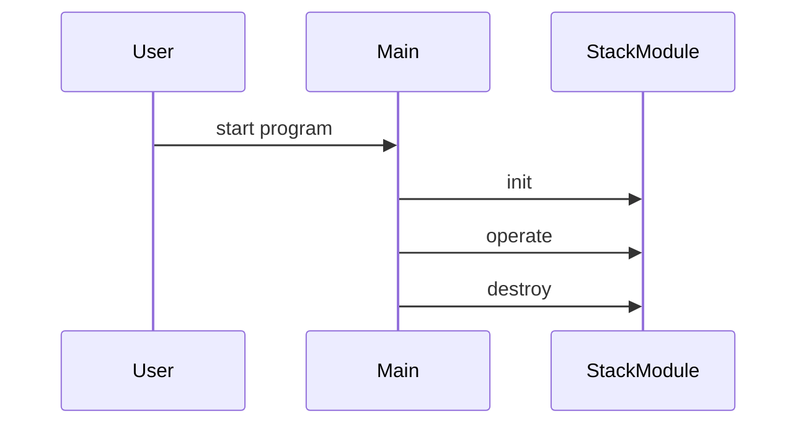

# Design Document

## Architecture Overview
The project is a C library providing a Stack module.

## Module Specifications
- `stack.h`: Public API declarations for the stack component.
- `stack.c`: Core implementation of stack operations.
- `main.c`: Example usage and demonstration program.
- `tests/test_runner.c`: Automated test harness validating stack functionality.

## Data Model
- `Stack` struct storing module state and resources.

## Sequence Flow

