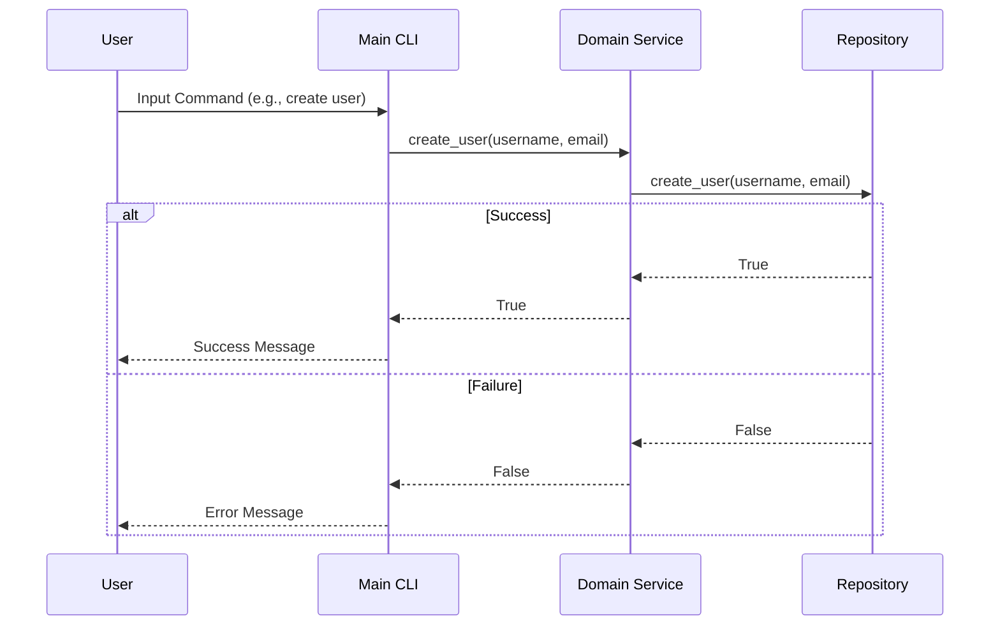

# System Architecture Overview

The system is designed following Clean Architecture principles, ensuring that the core domain logic is decoupled from external interfaces such as the CLI entry point and tests. The architecture consists of three main layers:

1. **Core Domain Logic**: This layer contains the business rules and logic of the application. It is independent of any external frameworks or libraries.
2. **CLI Entry Point**: This layer handles user input and output, providing a command-line interface for interacting with the system.
3. **Tests**: This layer includes unit tests and integration tests to ensure the correctness of the core domain logic.

# Module & Class Specifications

## Core Domain Logic

### UserManagementService
```python
class UserManagementService:
    def __init__(self, user_repository: UserRepository):
        self.user_repository = user_repository

    def create_user(self, username: str, email: str) -> bool:
        """
        Creates a new user with the given username and email.
        
        :param username: The username of the user to be created.
        :param email: The email address of the user to be created.
        :return: True if the user was successfully created, False otherwise.
        """
        # Implementation
        pass

    def get_user(self, user_id: int) -> User:
        """
        Retrieves a user by their ID.
        
        :param user_id: The ID of the user to retrieve.
        :return: The User object if found, None otherwise.
        """
        # Implementation
        pass

    def update_user(self, user_id: int, username: str, email: str) -> bool:
        """
        Updates an existing user's information.
        
        :param user_id: The ID of the user to update.
        :param username: The new username for the user.
        :param email: The new email address for the user.
        :return: True if the user was successfully updated, False otherwise.
        """
        # Implementation
        pass

    def delete_user(self, user_id: int) -> bool:
        """
        Deletes a user by their ID.
        
        :param user_id: The ID of the user to delete.
        :return: True if the user was successfully deleted, False otherwise.
        """
        # Implementation
        pass
```

### UserRepository
```python
class UserRepository:
    def create_user(self, username: str, email: str) -> bool:
        """
        Creates a new user in the repository.
        
        :param username: The username of the user to be created.
        :param email: The email address of the user to be created.
        :return: True if the user was successfully created, False otherwise.
        """
        # Implementation
        pass

    def get_user(self, user_id: int) -> User:
        """
        Retrieves a user from the repository by their ID.
        
        :param user_id: The ID of the user to retrieve.
        :return: The User object if found, None otherwise.
        """
        # Implementation
        pass

    def update_user(self, user_id: int, username: str, email: str) -> bool:
        """
        Updates an existing user's information in the repository.
        
        :param user_id: The ID of the user to update.
        :param username: The new username for the user.
        :param email: The new email address for the user.
        :return: True if the user was successfully updated, False otherwise.
        """
        # Implementation
        pass

    def delete_user(self, user_id: int) -> bool:
        """
        Deletes a user from the repository by their ID.
        
        :param user_id: The ID of the user to delete.
        :return: True if the user was successfully deleted, False otherwise.
        """
        # Implementation
        pass
```

### User
```python
class User:
    def __init__(self, user_id: int, username: str, email: str):
        self.user_id = user_id
        self.username = username
        self.email = email

    def get_user_id(self) -> int:
        """
        Returns the ID of the user.
        
        :return: The ID of the user.
        """
        return self.user_id

    def get_username(self) -> str:
        """
        Returns the username of the user.
        
        :return: The username of the user.
        """
        return self.username

    def get_email(self) -> str:
        """
        Returns the email address of the user.
        
        :return: The email address of the user.
        """
        return self.email
```

## CLI Entry Point

### UserCLI
```python
class UserCLI:
    def __init__(self, user_management_service: UserManagementService):
        self.user_management_service = user_management_service

    def run(self):
        """
        Runs the CLI and handles user input.
        """
        # Implementation
        pass

    def create_user_command(self, username: str, email: str) -> bool:
        """
        Handles the create user command.
        
        :param username: The username of the user to be created.
        :param email: The email address of the user to be created.
        :return: True if the user was successfully created, False otherwise.
        """
        # Implementation
        pass

    def get_user_command(self, user_id: int) -> User:
        """
        Handles the get user command.
        
        :param user_id: The ID of the user to retrieve.
        :return: The User object if found, None otherwise.
        """
        # Implementation
        pass

    def update_user_command(self, user_id: int, username: str, email: str) -> bool:
        """
        Handles the update user command.
        
        :param user_id: The ID of the user to update.
        :param username: The new username for the user.
        :param email: The new email address for the user.
        :return: True if the user was successfully updated, False otherwise.
        """
        # Implementation
        pass

    def delete_user_command(self, user_id: int) -> bool:
        """
        Handles the delete user command.
        
        :param user_id: The ID of the user to delete.
        :return: True if the user was successfully deleted, False otherwise.
        """
        # Implementation
        pass
```

## Tests

### UserManagementServiceTest
```python
class UserManagementServiceTest:
    def test_create_user(self):
        # Test implementation
        pass

    def test_get_user(self):
        # Test implementation
        pass

    def test_update_user(self):
        # Test implementation
        pass

    def test_delete_user(self):
        # Test implementation
        pass
```

### UserRepositoryTest
```python
class UserRepositoryTest:
    def test_create_user(self):
        # Test implementation
        pass

    def test_get_user(self):
        # Test implementation
        pass

    def test_update_user(self):
        # Test implementation
        pass

    def test_delete_user(self):
        # Test implementation
        pass
```

# Visual Sequence Diagrams



# Data Models & Boundary Validation Rules

## User Data Model
- **Dynamic Memory Handling**: Users are created and managed in memory. No dynamic allocation is required for basic operations.
- **Allocation Limits**: The system does not impose explicit limits on the number of users, but practical limits may be imposed by available memory.
- **Error State Models**: If a user creation fails due to invalid input (e.g., duplicate username), an error state is returned.

## Boundary Validation Rules
- **Username**: Must be non-empty and unique. Maximum length is 50 characters.
- **Email**: Must be in valid email format. Maximum length is 100 characters.

This design ensures that the system adheres to SOLID principles, with clear separation of concerns and easy testability.