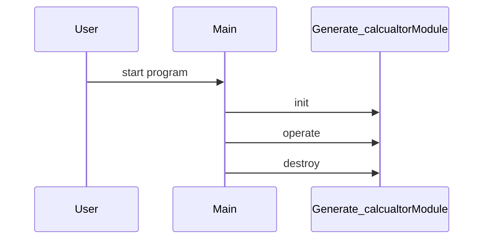

# Design Document

## Architecture Overview
The project is a C++ library providing a Generate_calcualtor module.

## Module Specifications
- `generate_calcualtor.hpp`: Public API declarations for the generate_calcualtor component.
- `generate_calcualtor.cpp`: Core implementation of generate_calcualtor operations.
- `main.cpp`: Example usage and demonstration program.
- `tests/test_runner.cpp`: Automated test harness validating generate_calcualtor functionality.

## Data Model
- `Generate_calcualtor` struct storing module state and resources.

## Sequence Flow

