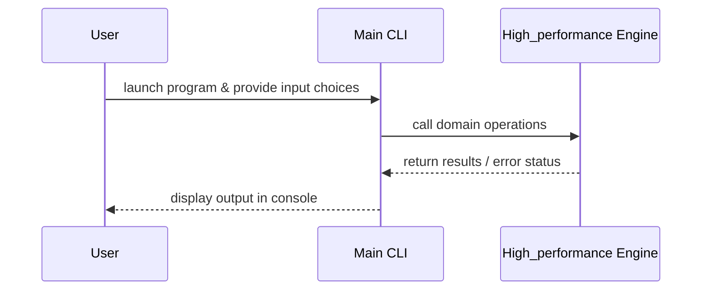

# Design Document

## Architecture Overview
The project is a C++ application providing the `high_performance` module.

## Module Specifications
- `high_performance.hpp`: Public API declarations for the High Performance component.
- `high_performance.cpp`: Implementation of High Performance core logic.
- `main.cpp`: Interactive command-line interface accepting dynamic user inputs.
- `tests/test_runner.cpp`: Automated assertion test suite.

## Data Model
- Data structures and function signatures declared in `high_performance.hpp`.

## Sequence Flow

