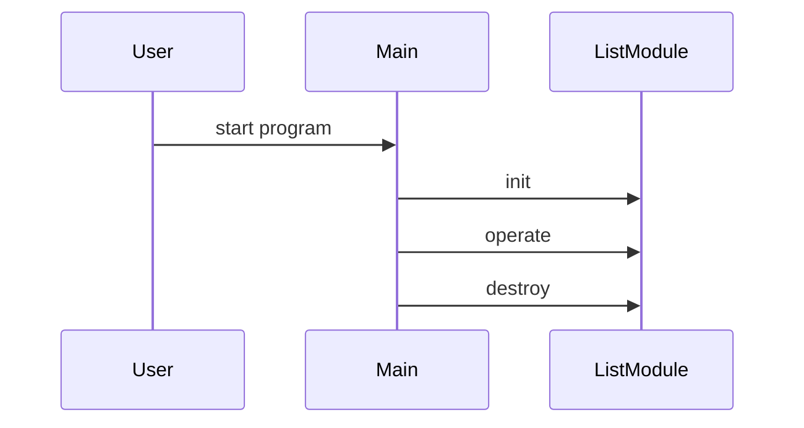

# Design Document

## Architecture Overview
The project is a C++ library providing a List module.

## Module Specifications
- `list.hpp`: Public API declarations for the list component.
- `list.cpp`: Core implementation of list operations.
- `main.cpp`: Example usage and demonstration program.
- `tests/test_runner.cpp`: Automated test harness validating list functionality.

## Data Model
- `List` struct storing module state and resources.

## Sequence Flow

