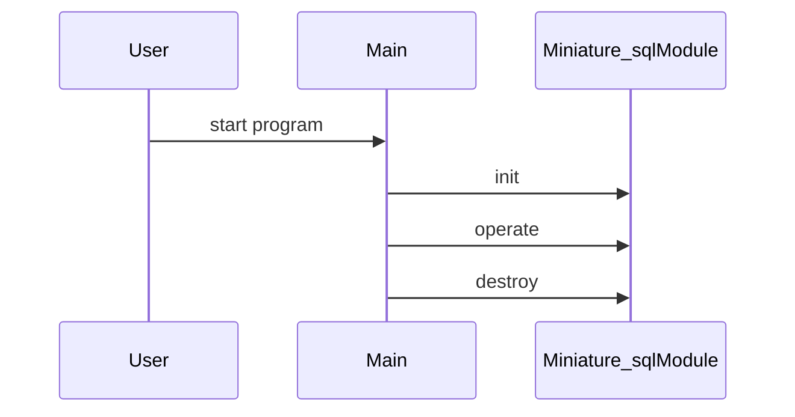

# Design Document

## Architecture Overview
The project is a C++ library providing a Miniature_sql module.

## Module Specifications
- `miniature_sql.hpp`: Public API declarations for the miniature_sql component.
- `miniature_sql.cpp`: Core implementation of miniature_sql operations.
- `main.cpp`: Example usage and demonstration program.
- `tests/test_runner.cpp`: Automated test harness validating miniature_sql functionality.

## Data Model
- `Miniature_sql` struct storing module state and resources.

## Sequence Flow

