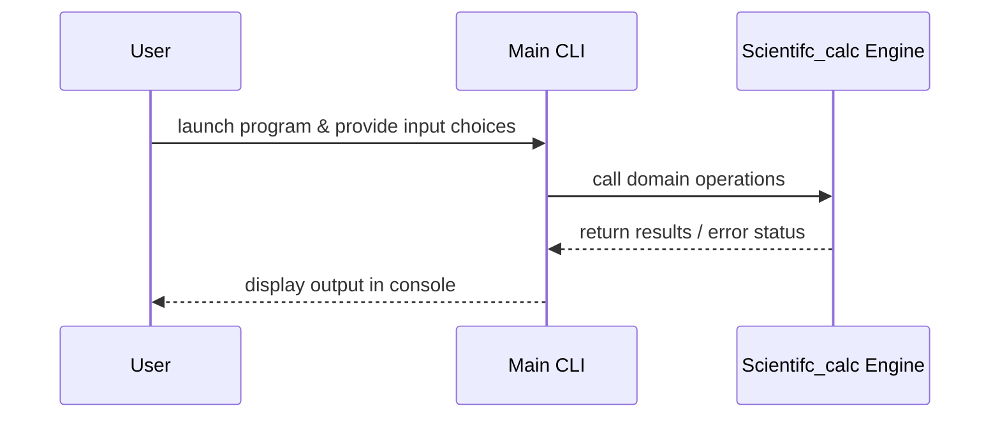

# Design Document

## Architecture Overview
The project is a C application providing the `scientifc_calc` module.

## Module Specifications
- `scientifc_calc.h`: Public API declarations for the Scientifc Calc component.
- `scientifc_calc.c`: Implementation of Scientifc Calc core logic.
- `main.c`: Interactive command-line interface accepting dynamic user inputs.
- `tests/test_runner.c`: Automated assertion test suite.

## Data Model
- Data structures and function signatures declared in `scientifc_calc.h`.

## Sequence Flow

