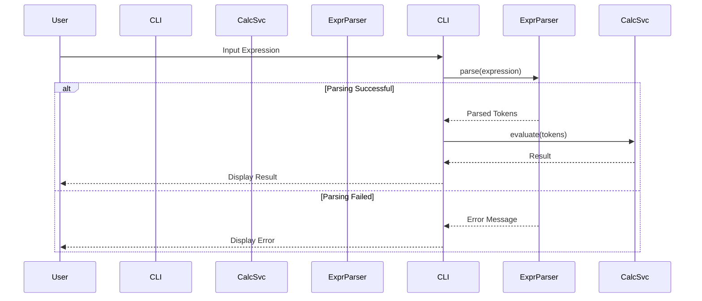

# Scientific Calculator Design Document

## 1. System Architecture Overview

The scientific calculator application is designed following Clean Architecture principles, ensuring a clear separation of concerns and adherence to SOLID design principles. The system is divided into three main layers:

### Core Domain Logic
- **Purpose**: Contains the business logic and rules of the application.
- **Components**:
  - `CalculatorService`: Handles all mathematical operations.
  - `ExpressionParser`: Parses user input expressions.

### CLI Entry Point
- **Purpose**: Acts as the interface for user interaction.
- **Components**:
  - `MainCLI`: Manages user input and output, delegating tasks to the domain logic.

### Tests
- **Purpose**: Ensures the correctness of the application through automated testing.
- **Components**:
  - Unit tests for each class in the Core Domain Logic.
  - Integration tests for interactions between components.

## 2. Module & Class Specifications

### Core Domain Logic

#### CalculatorService
```cpp
class CalculatorService {
public:
    double add(double a, double b);
    double subtract(double a, double b);
    double multiply(double a, double b);
    double divide(double a, double b) throw(std::invalid_argument);
    // Additional methods for scientific operations can be added here
};
```

#### ExpressionParser
```cpp
class ExpressionParser {
public:
    std::vector<std::string> parse(const std::string& expression) throw(std::invalid_argument);
};
```

### CLI Entry Point

#### MainCLI
```cpp
class MainCLI {
private:
    CalculatorService* calculator;
    ExpressionParser* parser;

public:
    MainCLI(CalculatorService* calc, ExpressionParser* exprParser);
    void run();
    double evaluateExpression(const std::string& expression) throw(std::invalid_argument);
};
```

## 3. Visual Sequence Diagrams



## 4. Data Models & Boundary Validation Rules

### Dynamic Memory Handling
- **CalculatorService**: Uses stack-based memory for simple operations.
- **ExpressionParser**: Uses dynamic memory for token storage, with a limit of 1024 tokens.

### Allocation Limits
- Maximum expression length: 256 characters.
- Maximum number of tokens: 1024.

### Error State Models
- `CalculatorService::divide`: Throws `std::invalid_argument` if division by zero is attempted.
- `ExpressionParser::parse`: Throws `std::invalid_argument` for malformed expressions.