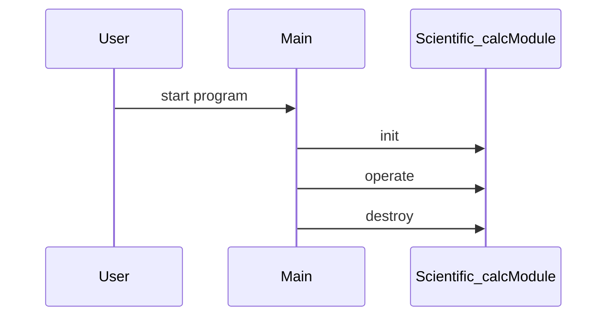

# Design Document

## Architecture Overview
The project is a C++ library providing a Scientific_calc module.

## Module Specifications
- `scientific_calc.hpp`: Public API declarations for the scientific_calc component.
- `scientific_calc.cpp`: Core implementation of scientific_calc operations.
- `main.cpp`: Example usage and demonstration program.
- `tests/test_runner.cpp`: Automated test harness validating scientific_calc functionality.

## Data Model
- `Scientific_calc` struct storing module state and resources.

## Sequence Flow

