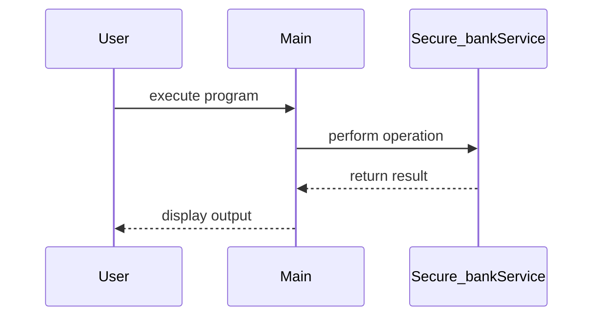

# Design Document

## Architecture Overview
The project is organized as a modular Python application centered on the `secure_bank` module.

## Module Specifications
- `secure_bank.py`: Core domain logic and operations.
- `main.py`: Application entry point and demonstration CLI.
- `tests/test_secure_bank.py`: Pytest suite for automated testing.

## Sequence Flow

