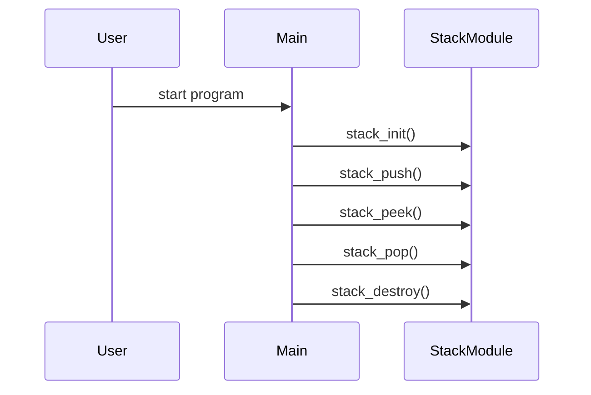

# Design Document

## Architecture Overview
The project is a small C library that provides a stack abstraction backed by a dynamic array.

## Module Specifications
- `stack.h`: Public API declarations for the stack data structure.
- `stack.c`: Core implementation of stack operations.
- `main.c`: Example usage and demonstration program.
- `tests/test_runner.c`: Automated test harness validating stack behavior.

## Data Model
- `Stack` struct storing an internal buffer, size, and capacity.

## Public APIs
- `stack_init(Stack *stack, size_t initial_capacity)`: Initialize a stack.
- `stack_push(Stack *stack, int value)`: Push value onto the stack.
- `stack_pop(Stack *stack, int *value)`: Pop top value with error handling.
- `stack_peek(const Stack *stack, int *value)`: Inspect the top value without removing it.
- `stack_is_empty(const Stack *stack)`: Return whether the stack is empty.
- `stack_destroy(Stack *stack)`: Free the stack resources.

## Sequence Flow

