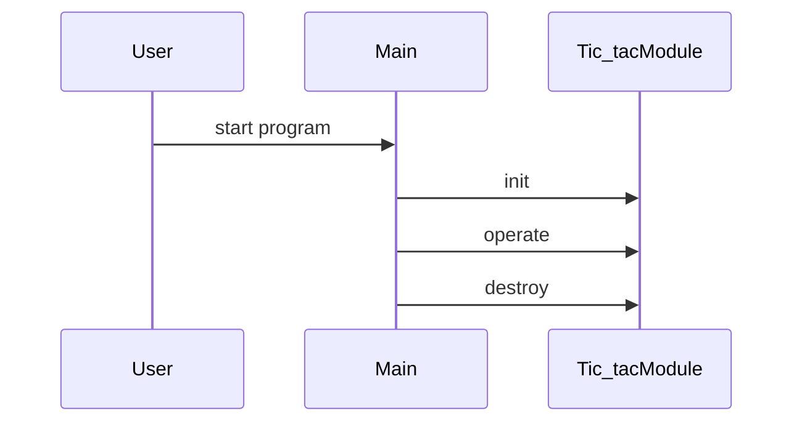

# Design Document

## Architecture Overview
The project is a C++ library providing a Tic_tac module.

## Module Specifications
- `tic_tac.hpp`: Public API declarations for the tic_tac component.
- `tic_tac.cpp`: Core implementation of tic_tac operations.
- `main.cpp`: Example usage and demonstration program.
- `tests/test_runner.cpp`: Automated test harness validating tic_tac functionality.

## Data Model
- `Tic_tac` struct storing module state and resources.

## Sequence Flow

