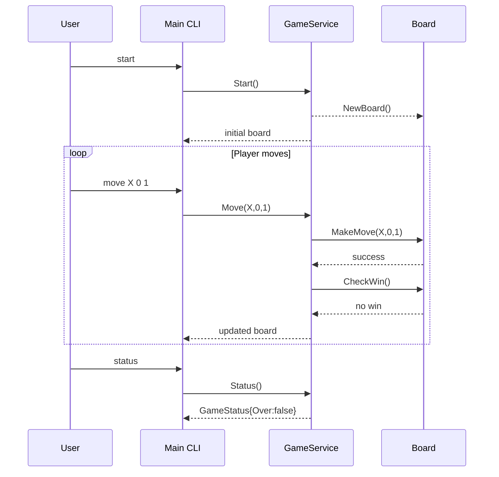

# Design

## 1. System Architecture Overview  

The application follows **Clean Architecture** and the **SOLID** principles to keep the core domain logic independent from external concerns such as user interaction or persistence.  
The system is split into three primary layers:

| Layer | Responsibility | Key Components |
|-------|-----------------|----------------|
| **Core Domain** | Encapsulates business rules (board state, move validation, win detection). | `domain` package – entities (`Board`, `Player`) and pure functions. |
| **Application Service** | Orchestrates domain objects to fulfill use‑cases. | `service` package – `GameService` interface and its concrete implementation. |
| **Interface Adapters** | Translates between the CLI (user) and the application service. | `cli` package – command parsing, input validation, output formatting. |
| **Frameworks & Drivers** | Entry point and test harnesses. | `main.go`, unit tests in `*_test.go`. |

*Decoupling*:  
- The domain layer has no dependencies on any external packages.  
- The service layer depends only on the domain interfaces (Dependency Inversion).  
- The CLI layer depends on the service interface, allowing it to be swapped or mocked for testing.

## 2. Module & Class Specifications  

### `domain` package

```go
// Player represents a game participant.
type Player string // "X" or "O"

// Cell coordinates on the board.
type Cell struct {
    Row int // 0‑based index (0–2)
    Col int // 0‑based index (0–2)
}

// Board holds the current state of the tic‑tac‑toe grid.
type Board struct {
    Cells [3][3]Player
}
```

#### Methods

```go
// NewBoard creates an empty board.
func NewBoard() *Board
```

```go
// MakeMove places a player's mark at the specified cell.
// Returns ErrInvalidMove if the move is out of bounds or the cell is occupied.
func (b *Board) MakeMove(p Player, r, c int) error
```

```go
// CheckWin evaluates the board and returns:
//   - true  and the winning player if a win exists,
//   - false and an empty string otherwise.
func (b *Board) CheckWin() (bool, Player)
```

```go
// IsFull reports whether all cells are occupied.
func (b *Board) IsFull() bool
```

#### Errors

```go
var (
    ErrOutOfBounds = errors.New("move out of bounds")
    ErrCellOccupied = errors.New("cell already occupied")
    ErrGameOver   = errors.New("game has already finished")
)
```

### `service` package

```go
// GameService defines the public API for a tic‑tac‑toe game.
type GameService interface {
    // Start initializes a new game and returns the initial board state.
    Start() *domain.Board

    // Move applies a player's move. Returns the updated board or an error.
    Move(p domain.Player, r, c int) (*domain.Board, error)

    // Status reports whether the game is ongoing, won, or drawn.
    Status() GameStatus
}
```

```go
// GameStatus represents the current state of the game.
type GameStatus struct {
    Over      bool
    Winner    domain.Player // empty if no winner yet
    Drawn     bool
}
```

Concrete implementation:

```go
type gameService struct {
    board   *domain.Board
    status  GameStatus
}
```

#### Implementation Highlights

- `Start()` creates a new `Board` and resets the status.  
- `Move()` validates that the game is not over, delegates to `board.MakeMove`, then updates `status` via `CheckWin` or `IsFull`.  
- All public methods are **pure** with respect to external state; they only modify internal fields.

### `cli` package

```go
// CLIController handles user interaction.
type CLIController struct {
    service service.GameService
}
```

#### Methods

```go
// Run parses command line arguments and drives the game loop.
// Supported commands: "start", "move X 1 2", "status".
func (c *CLIController) Run(args []string)
```

```go
// printBoard renders the board to stdout.
func (c *CLIController) printBoard(b *domain.Board)
```

```go
// parseMove extracts player and coordinates from a move command.
// Returns ErrInvalidCommand if parsing fails.
func parseMove(cmd string) (domain.Player, int, int, error)
```

### `main.go`

```go
func main() {
    svc := service.NewGameService()
    cli := cli.NewCLIController(svc)
    cli.Run(os.Args[1:])
}
```

## 3. Visual Sequence Diagram



## 4. Data Models & Boundary Validation Rules  

| Model | Field | Constraints |
|-------|-------|-------------|
| `Board` | `Cells[3][3]Player` | Indexes 0–2; empty cell represented by empty string. |
| `Move` | `Row`, `Col` | Must be within bounds (0 ≤ r,c < 3). |
| `GameStatus` | `Over`, `Winner`, `Drawn` | Mutually exclusive: if `Winner != ""` then `Drawn == false`. |

### Validation Rules

1. **Out‑of‑Bounds**  
   - If `r` or `c` is outside 0–2, return `ErrOutOfBounds`.

2. **Cell Occupied**  
   - If the target cell already contains a player mark, return `ErrCellOccupied`.

3. **Game Over**  
   - Any move attempted after `status.Over == true` results in `ErrGameOver`.

4. **Win Detection**  
   - After each successful move, evaluate all 8 winning lines (rows, columns, diagonals).  
   - If a line contains the same non‑empty player mark, set `Winner` and `Over = true`.

5. **Draw Condition**  
   - When `board.IsFull()` returns true and no winner, set `Drawn = true` and `Over = true`.

### Dynamic Memory Handling

- The board uses a fixed 3×3 array; no dynamic allocation is required during gameplay.  
- All other data structures (`GameStatus`, service fields) are simple value types or pointers to the board, ensuring minimal heap usage.  
- Error handling follows Go idioms: errors are returned rather than panicking, allowing callers (CLI) to present user‑friendly messages.

---

This design aligns with the functional requirements outlined in **SRS.md** and incorporates the changes noted in **Requirement_Delta_Report.md**, ensuring a clean separation of concerns, testability, and adherence to SOLID principles.