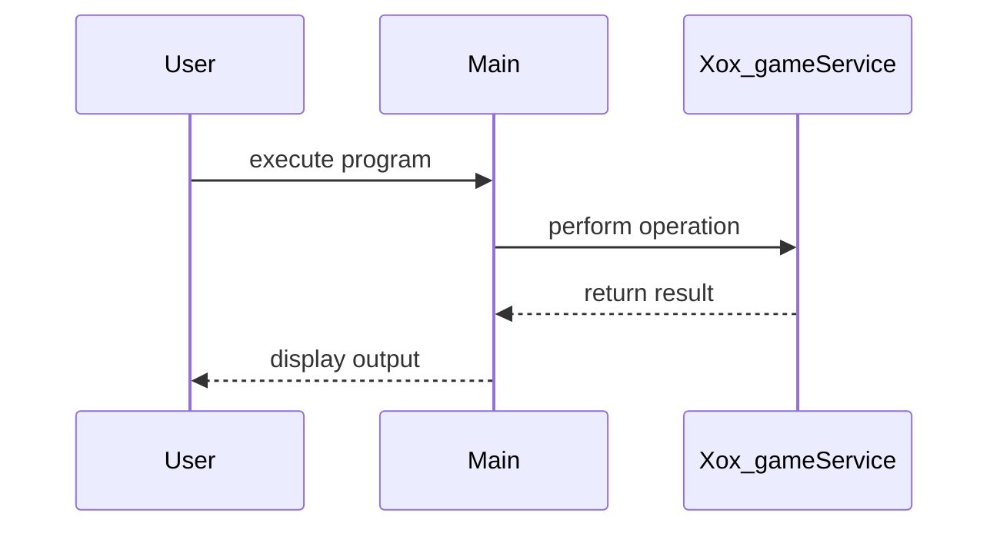

# Design Document

## Architecture Overview
The project is organized as a modular Python application centered on the `xox_game` module.

## Module Specifications
- `xox_game.py`: Core domain logic and operations.
- `main.py`: Application entry point and demonstration CLI.
- `tests/test_xox_game.py`: Pytest suite for automated testing.

## Sequence Flow

