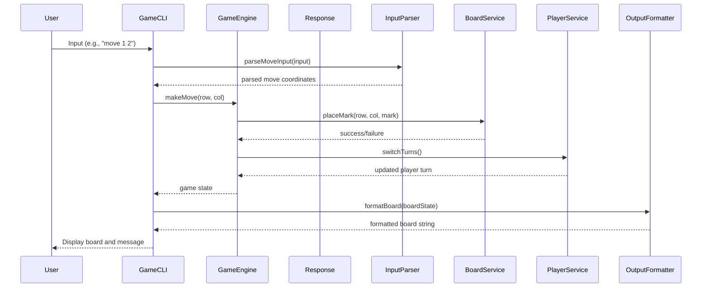

# XOX Game Design Document

## 1. System Architecture Overview

The XOX game follows a Clean Architecture design pattern, which is structured into decoupled modular layers to ensure separation of concerns and maintainability.

### Core Domain Logic
- **GameEngine**: Contains the business logic for managing the game state, including board updates, win conditions, and player turns.
- **PlayerService**: Manages player-related operations such as adding players, switching turns, and checking player status.
- **BoardService**: Handles the game board operations, including initializing the board, placing marks, and checking for a full board.

### CLI Entry Point
- **GameCLI**: Acts as the entry point for user interactions. It reads input from the command line, processes it, and displays output to the user.
- **InputParser**: Parses user inputs into commands that can be understood by the Core Domain Logic.
- **OutputFormatter**: Formats the game state and results for display in the CLI.

### Tests
- **UnitTests**: Contains unit tests for individual components such as GameEngine, PlayerService, and BoardService.
- **IntegrationTests**: Tests the interaction between different modules to ensure they work together correctly.
- **EndToEndTests**: Simulates user interactions through the CLI to test the entire system flow.

## 2. Module & Class Specifications

### Core Domain Logic
#### GameEngine
```cpp
class GameEngine {
public:
    GameEngine();
    void startGame();
    bool makeMove(int row, int col);
    bool checkWinCondition();
    bool isBoardFull();
    std::string getCurrentPlayer();

private:
    BoardService board;
    PlayerService players;
};
```

#### PlayerService
```cpp
class PlayerService {
public:
    PlayerService();
    void addPlayer(const std::string& name, char mark);
    void switchTurns();
    std::string getCurrentPlayerName();
    char getCurrentPlayerMark();

private:
    std::vector<std::pair<std::string, char>> players;
    int currentPlayerIndex = 0;
};
```

#### BoardService
```cpp
class BoardService {
public:
    BoardService();
    void initializeBoard(int size);
    bool placeMark(int row, int col, char mark);
    bool isCellEmpty(int row, int col);
    std::vector<std::vector<char>> getBoardState();

private:
    std::vector<std::vector<char>> board;
    int boardSize = 3;
};
```

### CLI Entry Point
#### GameCLI
```cpp
class GameCLI {
public:
    GameCLI(GameEngine& engine);
    void run();
    void displayBoard(const std::vector<std::vector<char>>& board);
    void displayMessage(const std::string& message);

private:
    GameEngine& gameEngine;
    InputParser inputParser;
    OutputFormatter outputFormatter;
};
```

#### InputParser
```cpp
class InputParser {
public:
    InputParser();
    std::pair<int, int> parseMoveInput(const std::string& input);
    std::string parseNameInput(const std::string& input);

private:
    // Helper methods for parsing logic
};
```

#### OutputFormatter
```cpp
class OutputFormatter {
public:
    OutputFormatter();
    std::string formatBoard(const std::vector<std::vector<char>>& board);
    std::string formatMessage(const std::string& message);

private:
    // Helper methods for formatting logic
};
```

### Tests
#### UnitTests
```cpp
class UnitTests {
public:
    void testGameEngine();
    void testPlayerService();
    void testBoardService();

private:
    GameEngine gameEngine;
    PlayerService playerService;
    BoardService boardService;
};
```

#### IntegrationTests
```cpp
class IntegrationTests {
public:
    void testGameFlow();
    void testPlayerTurns();

private:
    GameEngine gameEngine;
};
```

#### EndToEndTests
```cpp
class EndToEndTests {
public:
    void testCLIInteraction();

private:
    GameCLI gameCLI;
};
```

## 3. Visual Sequence Diagrams



## 4. Data Models & Boundary Validation Rules

### Dynamic Memory Handling
- **GameEngine**: Manages the lifecycle of `PlayerService` and `BoardService`.
- **BoardService**: Dynamically allocates memory for the game board based on the specified size.

### Allocation Limits
- The maximum board size is set to 10x10 to prevent excessive memory usage.
- Each player name must be between 1 and 20 characters long.

### Error State Models
- **GameEngine**: Returns `false` if a move is invalid (e.g., placing a mark on an occupied cell).
- **BoardService**: Throws exceptions for out-of-bounds access or invalid board size.
- **PlayerService**: Throws exceptions for duplicate player names or invalid marks.