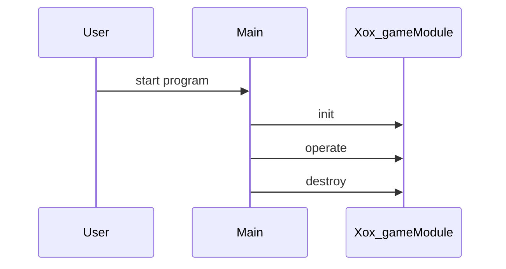

# Design Document

## Architecture Overview
The project is a C++ library providing a Xox_game module.

## Module Specifications
- `xox_game.hpp`: Public API declarations for the xox_game component.
- `xox_game.cpp`: Core implementation of xox_game operations.
- `main.cpp`: Example usage and demonstration program.
- `tests/test_runner.cpp`: Automated test harness validating xox_game functionality.

## Data Model
- `Xox_game` struct storing module state and resources.

## Sequence Flow

